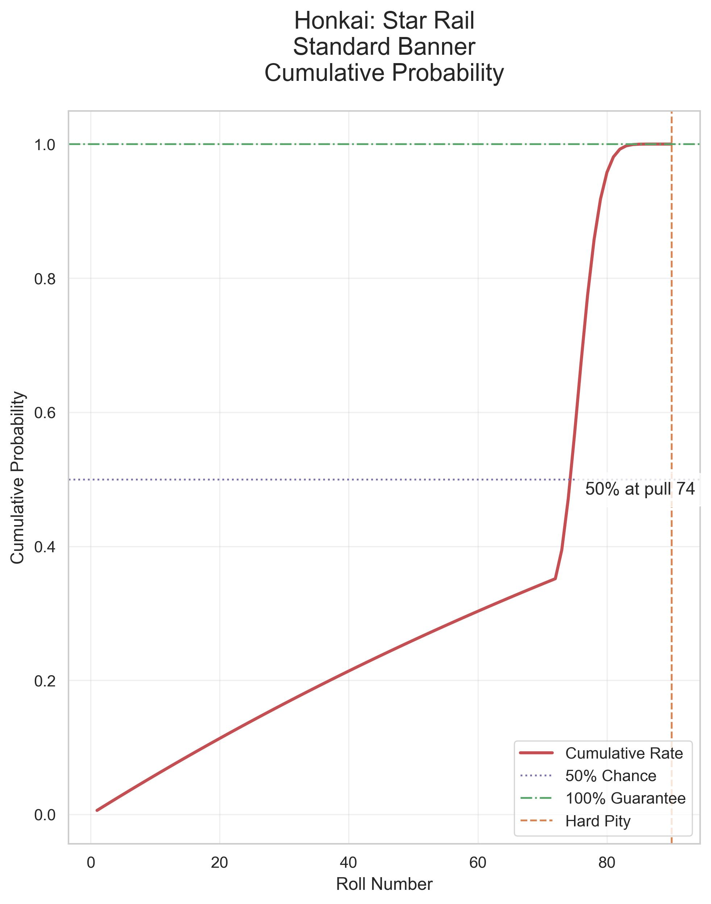
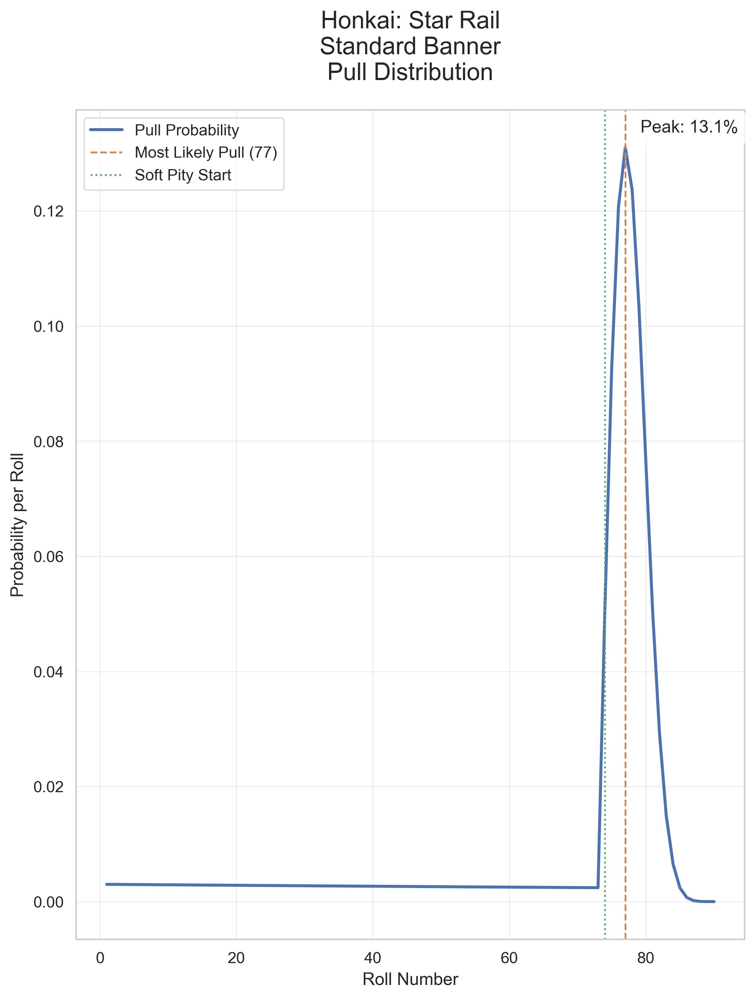
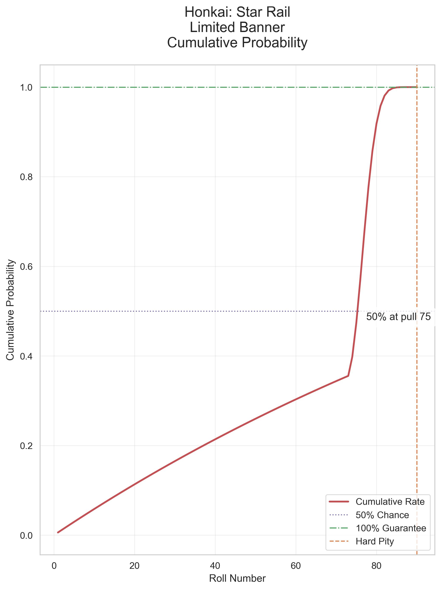
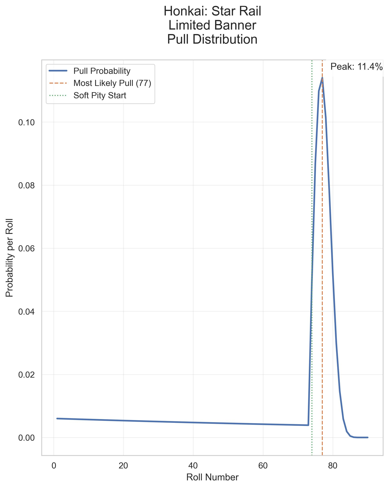
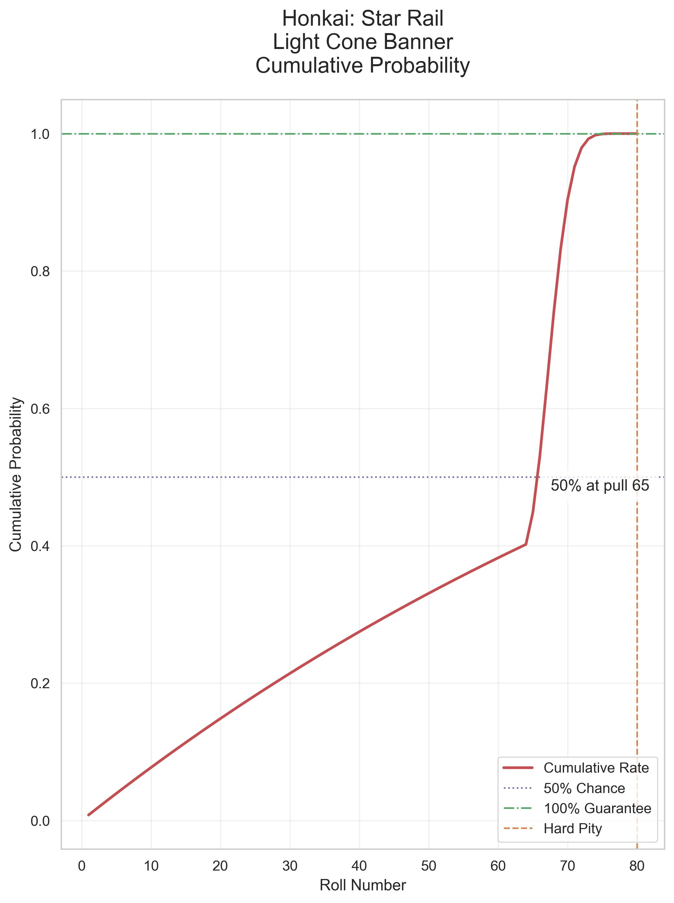
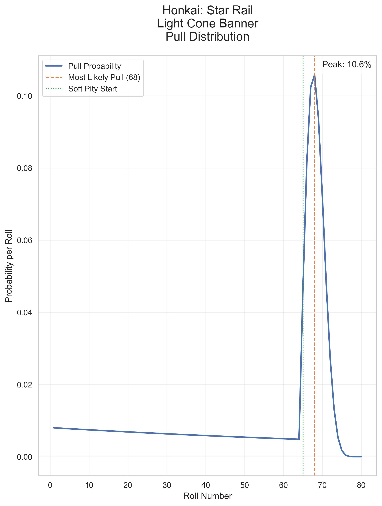

# Honkai Star Rail 5-Star Warp Probability Calculator

This is a simple calculator to help you estimate the probability of getting a 5-star character in Honkai Star Rail.

## Status

## How to use

1. Download the executable file from the [hsr-warp-calculator-app](./hsr-warp-calculator-app/) folder depending on your operating system.
    - [Windows](./hsr-warp-calculator-app/windows/hsrbannercalc.exe)
    - [MacOS Intel](./hsr-warp-calculator-app/macos-intel/HSRBannerCalc.app/Contents/MacOS/hsrbannercalc)
    - [MacOS Apple Silicon](./hsr-warp-calculator-app/macos-silicon/HSRBannerCalc.app/Contents/MacOS/hsrbannercalc)
2. Run the executable file.
3. Navigate to the <http://localhost:8080> in your browser.

## General Guidelines

- **Current Pity** is the number of pulls you have done without getting a 5-star character.
- **Planned Pulls** is the number of pulls you plan to do.

## Probability Statistics Visualizations

### Standard Banner

### Limited Banner

### Light Cone Banner

Reference:

<https://www.hoyolab.com/article/497840>

<https://starrailstation.com/en/warp#global>

## How to run the statistics

1. Install Python on your machine.
2. Navigate to the `stats` folder.
   - `cd stats`
3. Install the requirements.
   - `pip install -r requirements.txt`
4. Run the `hsr_warp_stats.py` file.
   - `python hsr_warp_stats.py`
